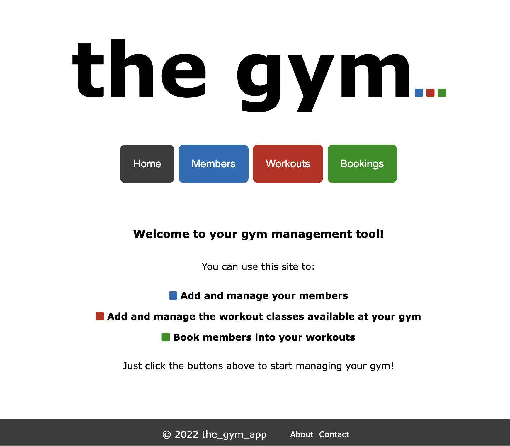

# The Gym  

### Project Brief
A local gym has asked you to build a piece of software to help them to manage memberships, and register members for classes.

MVP:
The app should allow the gym to create and edit Members and Classes
The app should allow the gym to book members on specific classes
The app should show a list of all upcoming classes
The app should show all members that are booked in for a particular class

Possible Extensions:
Classes could have a maximum capacity, and users can only be added while there is space remaining.
The gym could be able to give its members Premium or Standard membership. Standard members can only be signed up for classes during off-peak hours.
The Gym could mark members and classes as active/deactivated. Deactivated members/classes will not appear when creating bookings.

### Technologies Used
This app was built in Flask using the Python3, SQLite3, HTML and CSS languages.

### Lessons from this Project
This project gave me experience in planning and building a full app from scratch, working with databases with many-to-many relationships and passing data from the back-end to the front-end of an app.

### App Demo
[
<video src="https://user-images.githubusercontent.com/103276344/188515715-62cc4345-5c7e-451a-b27b-aec02d9b0fdd.mp4" width=180/>

https://user-images.githubusercontent.com/103276344/188515715-62cc4345-5c7e-451a-b27b-aec02d9b0fdd.mp4

### Running Instructions
1. To run this app, clone the git repository.

2. Open up the terminal then cd all th way into the gym_app folder and run the following command:
      sqlite3 db/gym_db.db < db/gym_db.sql

   This will add the database to your system.

3. Next, run the following command in the terminal:
      python3 console.py
   
   This will seed the database with some dummy data.

4. Finally, still in the terminal run the following comma

nd:
      flask run

   And click on the link that comes up to open the app in your web browser.

